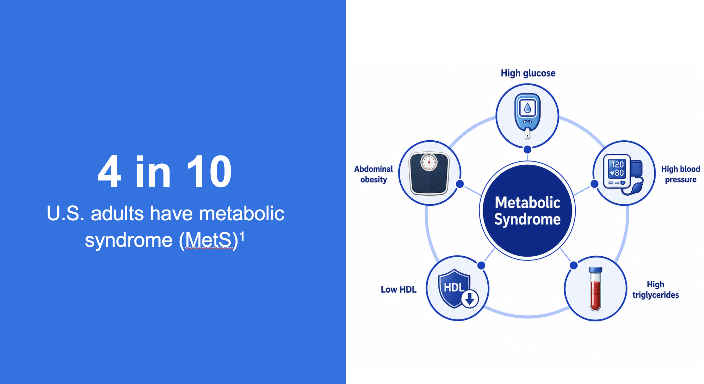
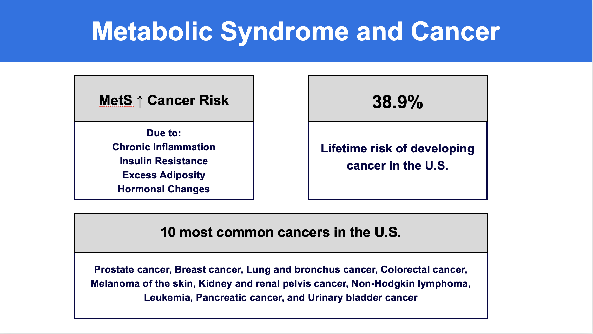
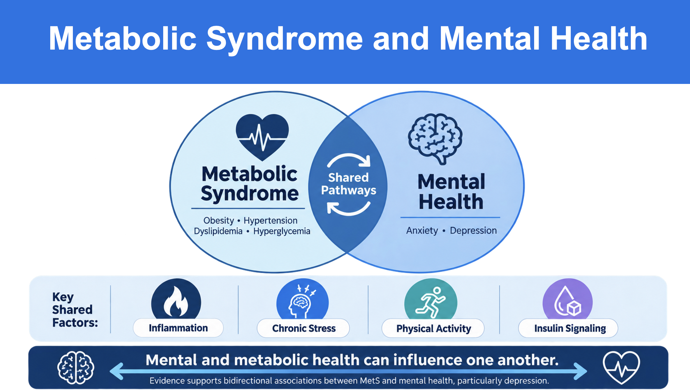
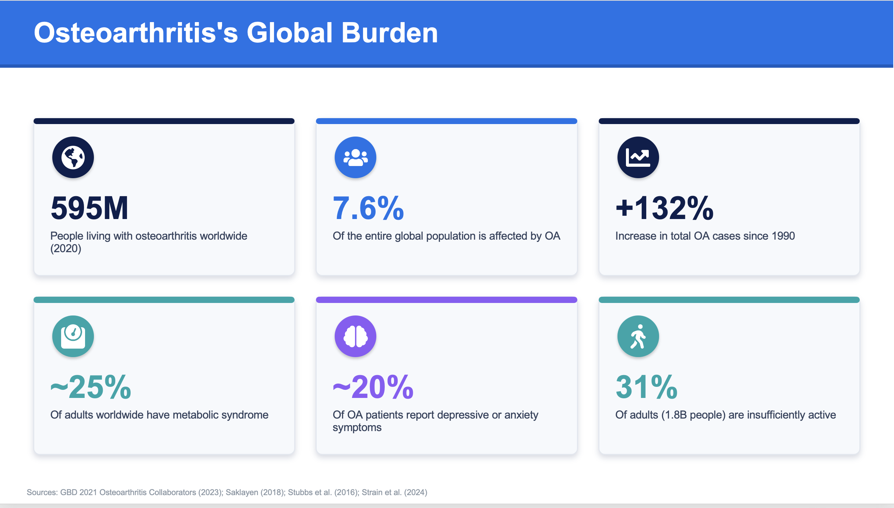
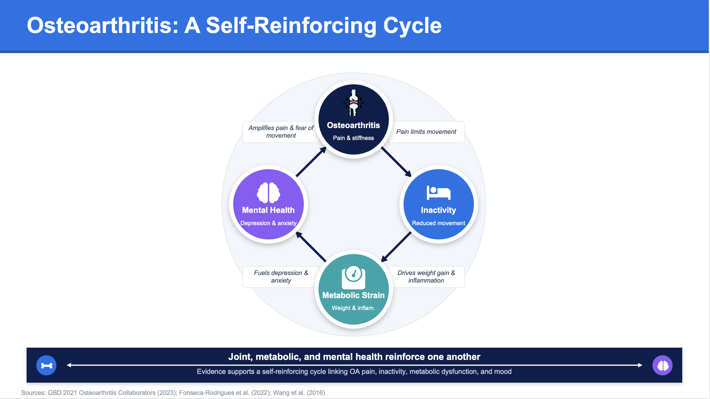

## Why MetaSense? {.center}

**Health systems often see chronic disease one condition at a time.**

But mental-health burden, metabolic dysfunction, osteoarthritis, and cancer commonly **cluster together** in ways that increase functional decline and care complexity.

::: {style="margin-top: 1.5em; font-size: 1.05em;"}
**MetaSense goal:**\
Use large-scale clinical data to discover multimorbidity profiles, then use passive wearable activity patterns to stratify high-burden risk
:::

::: callout-note
**Use case:** screening and population-health insight — *not* diagnosis or automated treatment decisions.
:::

------------------------------------------------------------------------

## MetS and Cancer {.center}

{width="85%"}

------------------------------------------------------------------------

## MetS and Cancer: Mechanistic Links {.center}

{width="85%"}

------------------------------------------------------------------------

## MetS and Cancer: Risk Stratification {.center}

{width="85%"}

------------------------------------------------------------------------

## OA Burden and Functional Decline {.center}

{width="85%"}

------------------------------------------------------------------------

## OA Burden: Activity Patterns {.center}

{width="85%"}

## Project Architecture {.center}

::: {.callout-tip}
**Key protection:** diagnoses used to define LCA classes were **not** used as ML predictors.
:::

::: {style="font-size: 0.9em; margin-top: 1em;"}
*Architecture diagram: LCA phenotype discovery → Wearable-based stratification → Interactive dashboard deployment*
:::

------------------------------------------------------------------------

## Data Sources and Cohorts {.smaller}

| Cohort | Sample | Purpose |
|----------------------|---------------------------:|----------------------|
| All of Us LCA cohort | **218,619** | Discover multimorbidity phenotypes |
| Wearable prediction cohort | **16,065** | Predict High Multidomain Burden from Fitbit + demographics |
| Florida subgroup | **497** | Regional benchmark |
| Northwest Florida ZIP3 324/325 | **5** | Too sparse for local estimates; future validation target |

**Fitbit preprocessing:** deduplicated person-day records, retained 100–100,000 daily steps, and required ≥30 valid activity days.

------------------------------------------------------------------------

## LCA Indicator Distribution {.smaller}

| Indicator            |  Present, n (%) |
|----------------------|----------------:|
| Mental-health burden | 113,193 (51.8%) |
| Obesity              | 111,545 (51.0%) |
| Hypertension         | 167,351 (76.5%) |
| Diabetes             |  77,666 (35.5%) |
| Dyslipidemia         |  61,888 (28.3%) |
| Osteoarthritis       | 109,539 (50.1%) |
| Cancer               |  34,183 (15.6%) |

**Interpretation:** this cohort contains substantial metabolic, musculoskeletal, cancer, and mental-health burden — ideal for phenotype discovery.

------------------------------------------------------------------------

## Five Multimorbidity Phenotypes {.smaller}

| Phenotype | Prevalence | Defining Pattern |
|:---|---:|:---|
| **High Multidomain Burden** | **33.2%** | High MH, obesity, HTN, diabetes, OA, cancer enrichment |
| Hypertension-Dominant | 21.9% | Nearly universal HTN; lower diabetes/dyslipidemia |
| Obesity-Dominant | 19.6% | Universal obesity; lower broader cardiometabolic burden |
| Diabetes-Dominant | 14.9% | Universal diabetes; moderate HTN |
| Dyslipidemia/OA-Dominant | 10.5% | Dyslipidemia with OA; moderate HTN |

::: {style="margin-top: 1em; font-size: 0.9em;"}
**LCA Model Quality:** entropy = **0.769** | mean max posterior probability = **0.849**
:::

------------------------------------------------------------------------

## Why Focus ML on High Multidomain Burden? {.smaller}

We first tested full five-class prediction from wearables + demographics.

**Result:** modest discrimination\
Accuracy ≈ **0.42**; macro-F1 ≈ **0.34**

The hardest boundary was **Diabetes-Dominant vs High Multidomain Burden**, consistent with LCA posterior overlap.

::: callout-important
**Clinical refinement:** High Multidomain Burden became the primary actionable prediction target because it represents the broadest and most clinically complex phenotype.
:::

------------------------------------------------------------------------

## Wearable Features Used in ML {.smaller}

After reducing highly correlated step features, the final model used:

-   Mean daily steps
-   Step coefficient of variation
-   \% days with **\<3,000** steps
-   \% days with **≥10,000** steps
-   Weekend–weekday step difference
-   Valid activity days
-   Wear density

Plus: age, sex at birth, race/ethnicity, education, marital status, and broad geographic region.

**ZIP code/ZIP3 were retained for reporting, not entered into the ML model.**

------------------------------------------------------------------------

## Tuned XGBoost Performance {.smaller}

| Metric | Held-out Test |
|:---|---:|
| **ROC AUC** | **0.691** |
| **Sensitivity** | **0.715** ✓ |
| **Specificity** | **0.551** |
| **PPV** | **0.389** |
| **NPV** | **0.829** ✓ |
| **F1 score** | **0.504** |
| **Brier score** | **0.185** |

::: {style="margin-top: 1em; font-size: 0.9em; line-height: 1.6;"}
**Interpretation:** Moderate but stable screening performance.\
High NPV indicates strong negative predictive value for rule-out decisions.\
Calibration AUC = **0.687** | test AUC = **0.691**
:::

------------------------------------------------------------------------

## Trust Layer: Calibration + Conformal Prediction {.smaller}

::: {style="margin-bottom: 1.2em;"}
**Risk gradient:** Observed High Multidomain Burden increases from **5.4%** (lowest risk decile) → **54.8%** (highest decile)
:::

**Class-conditional conformal prediction at 90% nominal coverage:**

| Output | n (%) | Clinical Meaning |
|:---|---:|:---|
| `{Other}` | 600 (24.9%) | ✓ Lower-burden pattern supported |
| `{HighBurden}` | 312 (13.0%) | ⚠ Elevated-burden signal |
| `{HighBurden, Other}` | 1,498 (62.2%) | ❓ Uncertain; more info recommended |

::: {style="margin-top: 1em; font-size: 0.9em;"}
**Coverage achieved:** 90.8% (HighBurden) | 91.2% (Other)
:::

------------------------------------------------------------------------

## Florida Translation and Next Steps {.smaller}

::: {style="margin-bottom: 1.2em;"}
**Florida subgroup (n=497)**\
High Multidomain Burden: **32.2%** vs **28.4%** nationally
:::

::: {style="columns: 2;"}
**Activity Differences:**

- Lower median daily steps:\
  **5,670** vs **5,982**
  
- More low-activity days:\
  **17.3%** vs **15.6%**
  
- Fewer ≥10,000-step days:\
  **7.7%** vs **9.8%**

**Next Phase:**

✓ Validate with regional partners\
✓ Deploy XGBoost model\
✓ Integrate conformal predictions\
✓ Expand Northwest Florida (n=5 → validation sample)
:::